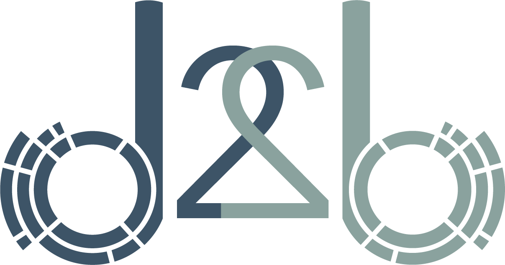

## What is it?

A d3-based reusable charting library.

## Why use it?

There are several reasons to use d2b over other charting frameworks. Here are some of them:

* It harnesses the power of d3.js, and is built using the same module design.
* Easy to start using if you already know d3 and a great place to start if you'd like to learn more about d3.
* It Uses rollup.js as a bundler, which makes it possible to create a custom d2b build.
* Although it uses a similar implementation pattern as d3, it's purpose is to give you a suite of charts to use out of the box.  
* The d2b charts are highly configurable, which is made easy by the module design.

## Installing

If you use NPM, `npm install d2b`. Otherwise you can download the latest build [here](https://github.com/d2bjs/d2b). CDN coming soon.

## API Reference

You can see the d2b API references [here](https://d2bjs.github.io).

## Examples

You can try out many d2b examples [here](http://d2bjs.org).
