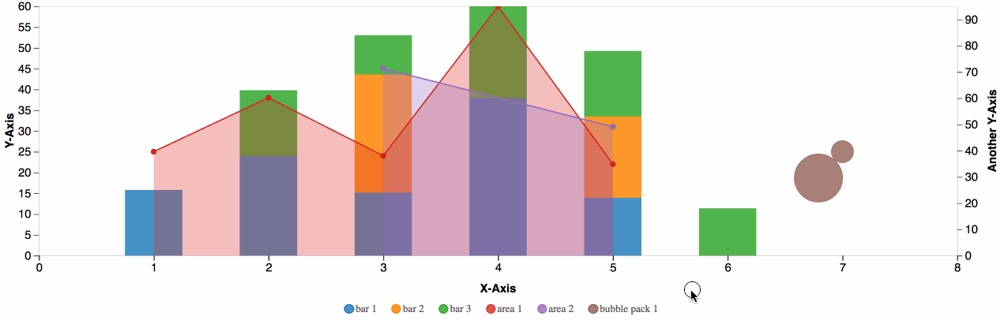

> [d2b](../README.md) › **Axis Configured Demos**

<!--  -->

 # {#multiple_chart}
### [#](multiple_chart) Multi Chart
Here is a live interactive demo of multiple default axis charts without any extra configurations. Simply add another `generators` object with the desired graph types and respective data to create a new chart. The charts created are displayed in a stack-like manner. For example, the area chart is created first, then the bar/line, and then the bubble pack. This puts the area chart on the first/lower layer, then the bar/line chart is stacked on top, and lastly the bubble pack is stacked of the previous one, making it the last/top layer.
<figure class="axis_annotation">
  <iframe 
    src="https://codesandbox.io/embed/github/d2bjs/demos/tree/master/charts/axis/multiple-charts?runonclick=0&codemirror=1&module=/index.js&view=preview" 

  ></iframe>
</figure>

 # {#annotation}
### [#](#annotation) Annotation
Here is a live interactive demo of the default area axis chart with annotations without any extra configurations. You can annotate different points within the graph by creating an annotation object and setting it to a point object within the values array. 
<figure class="axis_annotation">
  <iframe 
    src="https://codesandbox.io/embed/github/d2bjs/demos/tree/master/charts/axis/annotation?runonclick=1&codemirror=1&module=/index.js&view=preview" 
  ></iframe>
</figure>

# {#axis_config}
### [#](#axis_config) Axis Config
Here is a live interactive demo of the default area axis chart with basic property configurations. Some of these configurations include axis labels, label orientations, label padding, tick mark sizes, and scaling. 
<figure class="area_basic">
  <iframe 
    src="https://codesandbox.io/embed/github/d2bjs/demos/tree/master/charts/axis/axis-config?runonclick=1&codemirror=1&module=/index.js&view=preview" 
  ></iframe>
</figure>

 # {#area_curve}
### [#](#area_curve) Area Curve
Here is a live interactive demo of the curved area axis chart without any extra configurations. 
<figure class="axis_area_curve">
  <iframe 
    src="https://codesandbox.io/embed/github/d2bjs/demos/tree/master/charts/axis/curve-area?runonclick=1&codemirror=1&module=/index.js&view=preview" 
  ></iframe>
</figure>

# {#groups}
### [#](#groups) Groups
Here is a live interactive demo of the default area axis and line chart combo with group property configurations. You can assign multiple graphs into one group. Each group will share a color per graph, that way it is easier to see which graphs belong to which group. Additionally, multiple graph types can be included in a chart.
<figure class="axis_groups">
  <iframe 
    src="https://codesandbox.io/embed/github/d2bjs/demos/tree/master/charts/axis/groups?runonclick=1&codemirror=1&module=/index.js&view=preview" 
  ></iframe>
</figure>

# {#horizontal_bar}
### [#](#horizontal_bar) Horizontal Bar
Here is a live interactive demo of the horizontal bar axis chart. It is similar in concept to the regular bar chart with a change to the `orient` property from `vertical` to `horizontal`.
<figure class="axis_legend">
  <iframe 
    src="https://codesandbox.io/embed/github/d2bjs/demos/tree/master/charts/axis/horizontal-bar?runonclick=1&codemirror=1&module=/index.js&view=preview" 
  ></iframe>    
</figure>

# {#legend}
### [#](#legend) Legend
Here is a live interactive demo of the area axis chart combo with legend property configurations. Some of these configurations include legend icon clickability, orientation, and icon symbols.
<figure class="axis_legend">
  <iframe 
    src="https://codesandbox.io/embed/github/d2bjs/demos/tree/master/charts/axis/legend?runonclick=1&codemirror=1&module=/index.js&view=preview"  
  ></iframe>    
</figure>

# {#padding}
### [#](#padding) Padding
Here is a live interactive demo of the default area axis chart with padding configurations. Some of these configurations include chart padding, plane padding, and margins. These properties makes the charts and graphs easier to look at if the graphs start to look clustered within the chart.
<figure class="axis_padding">   
  <iframe     
    src="https://codesandbox.io/embed/github/d2bjs/demos/tree/master/charts/axis/padding?runonclick=1&codemirror=1&module=/index.js&view=preview" 
  ></iframe>
</figure>

# {#scale}
### [#](#scale) Scale
Here is a live interactive demo of the default area axis chart with axis scaling configurations. The scaling object is within the `x`-axis and/or the `y`-axis object. The type of axis declared will allow for different properties to be used. Certain properties are not interchangeable with all types. Like in the example below, a `type:"log"` axis is set and this allows the `base` property to be used. If `type:"log"` is set and a property from another type is used, for example the `exponent` property from `type:"pow"`, the graph will not render properly.
<figure class="axis_scale">
  <iframe 
    src="https://codesandbox.io/embed/github/d2bjs/demos/tree/master/charts/axis/area-scale?runonclick=1&codemirror=1&module=/index.js&view=preview" 
  ></iframe>
</figure>

# {#scatter_sizes}
### [#](#scatter_sizes) Scatter Varying Sizes
Here is a live interactive demo of the default scatter axis chart with varying point size configurations. The `size` property inside the `generators` array is a multiplier for the size of all the points in the graph.
<figure class="axis_scatter_sizes">
  <iframe 
    src="https://codesandbox.io/embed/github/d2bjs/demos/tree/master/charts/axis/default-scatter-sizes?runonclick=1&codemirror=1&module=/index.js&view=preview" 
  ></iframe>
</figure>

# {#stacked_bar}
### [#](#stacked_bar) Stacked Bar Chart
Here is a live interactive demo of the stacked bar chart without any extra configurations. 
<figure class="axis_stacked_bar">
  <iframe 
    src="https://codesandbox.io/embed/github/d2bjs/demos/tree/master/charts/axis/stacked-bar?runonclick=1&codemirror=1&module=/index.js&view=preview" 
  ></iframe>
</figure>

# {#transition}
### [#](#transition) Transition
Here is a live interactive demo of the axis chart with a transition configuration. If the button "Change Data!" is clicked, the axis chart will toggle between different data to demonstrate the transition animations. `.transition()` is used on the chart and chained with the desired `.duration(2000)` of microseconds. 
<figure class="pie_tooltip">
    <iframe 
        src="https://codesandbox.io/embed/github/d2bjs/demos/tree/master/charts/axis/transition?runonclick=1&codemirror=1&module=/index.js&view=preview" 
    ></iframe>
</figure>

 # {#typescript}
### [#](#typescript) Typescript
Here is a live interactive demo of the default area axis chart without any extra configurations using typescript. Typescript ensures proper types and properties are used when creating objects, arrays, etc.  
<figure class="axis_typescript">
  <iframe 
    src="https://codesandbox.io/embed/github/d2bjs/demos/tree/master/charts/axis/typescript?runonclick=1&codemirror=1&module=/index.ts&view=preview" 
  ></iframe>
</figure> 