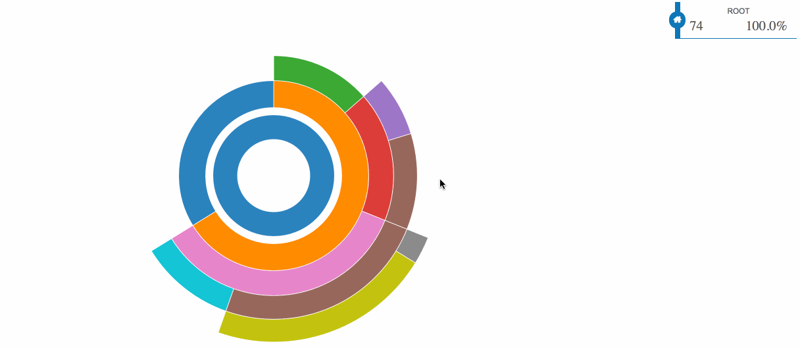

> [d2b](../README.md) › **Chart Sunburst**

<!--  -->

# {#generator}
[#](#generator) d2b.**chartSunburst**()

Constructs a new sunburst chart generator with the default settings.

When using the d2b-sunburst generator you can draw a sunburst chart onto each element in the selection.

# {#apply}
[#](#apply) *sunburst*(*context*)

Render the sunburst chart(s) to the given *context*, which may be either a [d3-selection](https://github.com/d3/d3-selection) of html containers (e.g. div) or a corresponding [d3-transition](https://github.com/d3/d3-transition).

Before applying the d2b-sunburst-chart generator, you should join the data to the selected element(s) using [selection.data](https://github.com/d3/d3-selection#selection_data) or [selection.datum](https://github.com/d3/d3-selection#selection_datum). Here is the default data format.

# {#sunburst_default}
### [#](#sunburst_default) Default Sunburst Chart

<figure class="sunburst_default">
    <iframe 
        src="https://codesandbox.io/embed/github/d2bjs/demos/tree/master/charts/sunburst/default?runonclick=0" 
        frameborder="0" 
        allowfullscreen="true" 
        mozallowfullscreen="true" 
        webkitallowfullscreen="true"
    ></iframe>
</figure>

# {#basic}
### [#](#basic) Basic

<figure class="sunburst_basic">
    <iframe 
        src="https://codesandbox.io/embed/github/d2bjs/demos/tree/master/charts/sunburst/basic?runonclick=0" 
        frameborder="0" 
        allowfullscreen="true" 
        mozallowfullscreen="true" 
        webkitallowfullscreen="true"
    ></iframe>
</figure>

# {#breadcrumbs}
### [#](#breadcrumbs) Breadcrumbs

<figure class="sunburst_breadcrumbs">
    <iframe 
        src="https://codesandbox.io/embed/github/d2bjs/demos/tree/master/charts/sunburst/breadcrumbs?runonclick=1" frameborder="0" 
        allowfullscreen="true" 
        mozallowfullscreen="true" 
        webkitallowfullscreen="true"
    ></iframe>
</figure>

# {#Padding}
### [#](#Padding) Padding

<figure class="sunburst_padding">
    <iframe 
        src="https://codesandbox.io/embed/github/d2bjs/demos/tree/master/charts/sunburst/padding?runonclick=1" 
        frameborder="0"
        allowfullscreen="true" 
        mozallowfullscreen="true" 
        webkitallowfullscreen="true"
    ></iframe>
</figure>

# {#Radius}
### [#](#Radius) Radius

<figure class="sunburst_radius">
    <iframe 
        src="https://codesandbox.io/embed/github/d2bjs/demos/tree/master/charts/sunburst/radius?runonclick=0" 
        frameborder="0" 
        allowfullscreen="true" 
        mozallowfullscreen="true" 
        webkitallowfullscreen="true"
    ></iframe>
</figure>

# {#Root}
### [#](#root) Root

<figure class="sunburst_root">
    <iframe 
        src="https://codesandbox.io/embed/github/d2bjs/demos/tree/master/charts/sunburst/root?runonclick=0" 
        frameborder="0" 
        allowfullscreen="true" 
        mozallowfullscreen="true" 
        webkitallowfullscreen="true"
    ></iframe>
</figure>

# {#sort}
### [#](#sort) Sort

<figure class="sunburst_sort">
    <iframe 
        src="https://codesandbox.io/embed/github/d2bjs/demos/tree/master/charts/sunburst/sort?runonclick=0" 
        frameborder="0" 
        allowfullscreen="true" 
        mozallowfullscreen="true" 
        webkitallowfullscreen="true"
    ></iframe>
</figure>

# {#tooltip}
### [#](#tooltip) Tooltip

<figure class="sunburst_tooltip">
    <iframe 
        src="https://codesandbox.io/embed/github/d2bjs/demos/tree/master/charts/sunburst/tooltip?runonclick=0" 
        frameborder="0" 
        allowfullscreen="true" 
        mozallowfullscreen="true" 
        webkitallowfullscreen="true"
    ></iframe>
</figure>

# {#typescript}
### [#](#typescript) Typescript

<figure class="sunburst_typescript">
    <iframe 
        src="https://codesandbox.io/embed/github/d2bjs/demos/tree/master/charts/sunburst/typescript?runonclick=0" 
        frameborder="0" 
        allowfullscreen="true" 
        mozallowfullscreen="true" 
        webkitallowfullscreen="true"
    ></iframe>
</figure>

# {#properties}
# [#](#properties) Properties

This is a complete list of properties that may be supplied to the axis chart datum. **Bold** properties are required.

