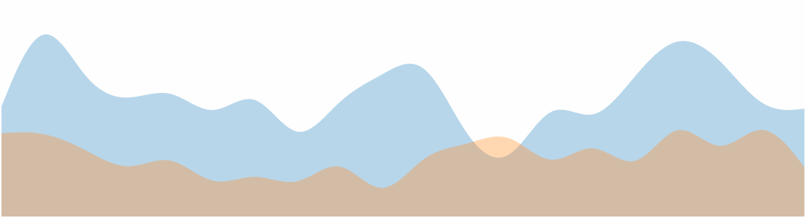

> [d2b](../README.md) › **SVG Area**



# {#generator}
[#](#generator) d2b.**svgArea**()

Constructs a new area generator with the default settings. This is not the same as [d3.area](https://github.com/d3/d3-shape#area). The purpose of this module is to provide a common graph API used in other types of graphs (e.g. area, line, bar).

When using the d2b-area generator you can draw multiple area graphs onto each element in the selection. This is shown in the data example below.

# {#apply}
[#](#apply) *area*(*context*)

Render the area(s) to the given *context*, which may be either a [d3-selection](https://github.com/d3/d3-selection) of SVG containers (either SVG or G elements) or a corresponding [d3-transition](https://github.com/d3/d3-transition).

Before applying the d2b-area generator, you should join the data to the selected element(s) using [selection.data](https://github.com/d3/d3-selection#selection_data) or [selection.datum](https://github.com/d3/d3-selection#selection_datum). Here is the default data format.

```javascript
var area = d2b.svgArea();

var datum = [
  {
    label: 'Area Graph 1',
    values: [
      {x: 1, y: 18},
      {x: 2, y: 10},
      {x: 3, y: 26},
      {x: 4, y: 35},
      {x: 5, y: 14},
    ]
  },
  {
    label: 'Area Graph 2',
    values: [
      {x: 1, y: 13},
      {x: 2, y: 26},
      {x: 3, y: 41},
      {x: 4, y: 14},
      {x: 5, y: 36},
    ]
  }
];

d3.select('.chart')
    .datum(datum)
    .call(area);  
```

# {#type}
[#](#type) area.**type**()

Returns the string `area`.

# {#area}
[#](#area) area.**area**([*d3-area*])

If *d3-area* is specified, sets the *d3-area* generator to the specified [d3-area](https://github.com/d3/d3-shape#area) and returns the d2b area generator. If *d3-area* is not specified, returns the current *d3-area* generator, which defaults to [d3.area()](https://github.com/d3/d3-shape#area).

The *d3-area* can be configured at will, except for the [x](https://github.com/d3/d3-shape#x) and [y](https://github.com/d3/d3-shape#y) properties which will be set automatically by the d2b area generator.

# {#stack}
[#](#stack) area.**stack**([*d3-stack*])

If *d3-stack* is specified, sets the *d3-stack* generator to the specified [d3-stack](https://github.com/d3/d3-shape/blob/master/README.md#stack) and returns the area generator. If *d3-stack* is not specified, returns the current *d3-stack* generator, which defaults to [d3.stack()](https://github.com/d3/d3-shape/blob/master/README.md#stack).

The *d3-stack* can be configured at will, except for the [keys](https://github.com/d3/d3-shape/blob/master/README.md#stack_keys) and [values](https://github.com/d3/d3-shape/blob/master/README.md#stack_value) properties which will be set automatically by the area generator.

# {#annotation}
[#](#annotation) area.**annotation**([*d3-annotation*])

If *d3-annotation* is specified, sets the annotation generator to the specified [d3-annotation](http://d3-annotation.susielu.com/) and returns the area generator. If *d3-annotation* is not specified, returns the current annotation generator, which defaults to a [d3.annotation()](http://d3-annotation.susielu.com/).

# {#x}
[#](#x) area.**x**([*x*])

If *x* is specified, sets the *x* scale to the specified [d3-scale](https://github.com/d3/d3-scale) and returns the area generator. If *x* is not specified, returns the current *x* scale, which defaults to a [d3.scaleLinear()](https://github.com/d3/d3-scale#scaleLinear).

# {#y}
[#](#y) area.**y**([*y*])

If *y* is specified, sets the *y* scale to the specified [d3-scale](https://github.com/d3/d3-scale) and returns the area generator. If *y* is not specified, returns the current *y* scale, which defaults to a [d3.scaleLinear()](https://github.com/d3/d3-scale#scaleLinear).

### Datum Level Accessors

When the d2b area generator is applied to a selection, the following properties will be invoked. The function will be passed the element's bound [datum](https://github.com/d3/d3-selection#selection_datum) `d` and the corresponding element index `i`.

# {#graphs}
[#](#graphs) area.**graphs**([*graphs*])

If *graphs* is specified, sets the *graphs* array to the specified accessor function or array and returns the area generator. If *graphs* is not specified, returns the current *graphs* accessor, which defaults to `d => d`.

### Graph Level Accessors

When the d2b area generator is applied to a selection, the following properties will be invoked for each graph in the [graphs](#graphs) array. The function will be passed the graph data `d` and the corresponding graph index `i`.

```javascript
function (d) {
  // Here is what d might contain
  // d => {
  //   label: 'Area Graph 1',
  //   values: [
  //     {x: 1, y: 18},
  //     {x: 2, y: 10},
  //     {x: 3, y: 26},
  //     {x: 4, y: 35},
  //     {x: 5, y: 14},
  //   ]
  // }
}
```

# {#tooltip_graph}
[#](#tooltip_graph) area.**tooltipGraph**([*tooltip_graph*])

If *tooltip_graph* is specified, sets the *tooltip_graph* to the specified accessor function and returns the area generator. If *tooltip_graph* is not specified, returns the current *tooltip_graph* accessor, which defaults to:

```javascript
  function (d) {
    return d.tooltipGraph;
  }
```

# {#shift}
[#](#shift) area.**shift**([*shift*])

If *shift* is specified, sets the horizontal *shift* to the specified accessor function or value and returns the area generator. If *shift* is not specified, returns the current *shift* accessor, which defaults to `() => null`.

If a `null` accessor is used this shift will be computed dynamically based on the type of [d3-scale](https://github.com/d3/d3-scale) being used. If a band scale is used then the shift will be set to half of the scales bandwidth.

# {#stack_by}
[#](#stack_by) area.**stackBy**([*stack_by*])

If *stack_by* is specified, sets the *stack_by* accessor to the specified accessor function and returns the area generator. If *stack_by* is not specified, returns the current *stack_by* accessor, which defaults to `() => null`.

If the accessor returns `falsy` then no graph stacking will be performed. If the accessor returns `truthy` then all graphs in a `datum` set will be stacked together. A more advanced method of stacking allows to stack specific graphs together, this can be done by using a stack property on the graph and setting the [stackBy](#stack_by) accessor accordingly. In the example below there will be two graphs stacked together under the key `1`, two graphs stacked together under the key `2`, and one other graph that is denoted as stack `3`.

```javascript
area.stackBy(function (d) {
  return d.stack;
});

data = {
  graphs: [
    {
      label: 'Area Graph 1',
      stack: 1,
      values: []
    },
    {
      label: 'Area Graph 2',
      stack: 1,
      values: []
    },
    {
      label: 'Area Graph 3',
      stack: 2,
      values: []
    },
    {
      label: 'Area Graph 4',
      stack: 2,
      values: []
    },
    {
      label: 'Area Graph 5',
      stack: 3,
      values: []
    }
  ]
}
```

# {#key}
[#](#key) area.**key**([*key*])

If *key* is specified, sets the graph *key* accessor to the specified accessor function and returns the area generator. If *key* is not specified, returns the current *key* accessor, which defaults to `(d) => d.label`.

If you are transitioning from one data set to another the key function is useful in making sure the proper graphs get updated to their corresponding values.

# {#color}
[#](#color) area.**color**([*color*])

If *color* is specified, sets the *color* accessor to the specified accessor function and returns the area generator. If *color* is not specified, returns the current *color* accessor, which defaults to:

```javascript
// define d3 color scale that will be used in the accessor
var color = d3.scaleOrdinal(d3.schemeCategory10);

function (d) {
  return color(d.label);
}
```

If you are transitioning from one data set to another the key function is useful in making sure the proper graphs get updated to their corresponding values.

# {#values}
[#](#values) area.**values**([*values*])

If *values* is specified, sets the *values* array to the specified accessor function or array and returns the area generator. If *values* is not specified, returns the current *values* accessor, which defaults to:

```javascript
function (d) {
  return d.values;
}
```

### Value Level Accessors

When the d2b area generator is applied to a selection, the following properties will be invoked for each element in the [values](#values) array. The function will be passed the value data `d` and the index position within the [values](#bubble_pack_children) array `i`.

```javascript
function (d, i) {
  // d => {
  //   x: 1,
  //   y: 18
  // }
}
```

# {#px}
[#](#px) area.**px**([*px*])

If *px* is specified, sets the *px* accessor to the specified accessor function and returns the area generator. If *px* is not specified, returns the current *px* accessor, which defaults to:

```javascript
function (d) {
  return d.x;
}
```

# {#py}
[#](#py) area.**py**([*py*])

If *py* is specified, sets the *py* accessor to the specified accessor function and returns the area generator. If *py* is not specified, returns the current *py* accessor, which defaults to:

```javascript
function (d) {
  return d.y;
}
```

# {#py0}
[#](#py0) area.**py0**([*py0*])

If *py0* is specified, sets the *py0* accessor to the specified accessor function and returns the area generator. If *py0* is not specified, returns the current *py0* accessor, which defaults to:

```javascript
function (d) {
  return null;
}
```

Note: When a `null` y0 is used it will default to `0`. Also, when stacking is applied y0 is ignored.

# {#pannotations}
[#](#pannotations) area.**pannotations**([*annotations*])

If *annotations* is specified, sets the *annotations* accessor to the specified accessor function and returns the area generator. If *annotations* is not specified, returns the current *annotations* accessor, which defaults to:

```javascript
function (d) {
  return d.annotations;
}
```

# {#pkey}
[#](#pkey) area.**pkey**([*key*])

If *key* is specified, sets the *key* accessor to the specified accessor function and returns the area generator. If *key* is not specified, returns the current *key* accessor, which defaults to `(d, i) => i`.

Because the area generator does not render discrete points, this will only be used in rendering [annotations](#annotations).

# {#pcolor}
[#](#pcolor) area.**pcolor**([*color*])

If *color* is specified, sets the *color* accessor to the specified accessor function and returns the area generator. If *color* is not specified, returns the current *color* accessor, which defaults to `() => null`.

If *color* is `null` then the corresponding graph [color](#color) will be used. Because the area generator does not render discrete points, this will only be used in rendering [annotations](#annotations).

## Annotations {#annotations}

The area graph generator has built in hooks for annotations using the [d3.annotation plugin](d3-annotation.susielu.com). Each value in an area graph may contain an annotation at its `y0` and `y1` locations. For example, an area value with two annotations:

```javascript
{
  x: 2,
  y: 41,
  annotations: [
    {
      // area value location y0 or y1
      location: 'y0',
      // dx/dy pixel offset that the annotation has from the value
      dy: -150,
      dx: -150,
      // use a custom annotation type from d3.annotation
      type: d3.annotationCalloutCircle,
      note: {
        title: 'Important Point at Y0'
      },
      subject: {
        radius: 20,
        radiusPadding: 5
      },
      connector: {
        end : "arrow"
      }
    },
    {
      // these are the minimum attributes that can be given for an annotation
      location: 'y1',
      dy: -60,
      dx: 0,
      note: {
        title: 'Important Point at Y1'
      },
    }
  ]
}
```

### Other Methods

# {#get_computed_graphs}
[#](#get_computed_graphs) area.**getComputedGraphs**(*context*)

Returns the array of computed graphs for the context's datum. This is not the same as the graphs array provided in the datum. This is a constructed graphs array that invokes all of the accessors described above. Usually this is used internally by the [d2b.chartAxis](../charts/chart-axis.md) module.

# {#get_visible_points}
[#](#get_visible_points) area.**getVisiblePoints**(*context*)

Returns the array of visible points. This array will be formed by concatenating all of the graph values and invoking the [px](#px) and [py](#py) accessor for each. Each value will have two elements from this visible points array, one for the discrete point's y0 and one for y1. This is helpful when trying to dynamically update the scale domains based on the range of x and y values. Usually this is used internally by the [d2b.chartAxis](../charts/chart-axis.md) module.

The returned array will look something like this:

```javascript
[
  {x: 1, y: 0, graph: {/*graph object*/}},
  {x: 1, y: 18, graph: {/*graph object*/}},
  // ...
]
```
