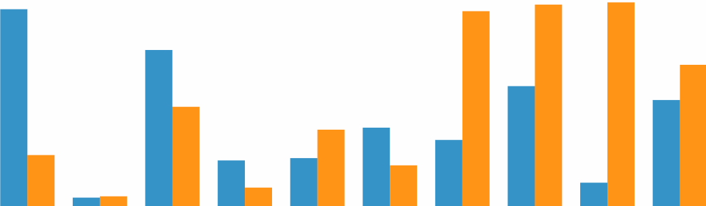

> [d2b](../README.md) › **SVG Bar**



# {#generator}
[#](#generator) d2b.**svgBar**()

Constructs a new bar generator with the default settings. The purpose of this module is to provide a common graph API used in other types of graphs (e.g. area, line, bar).

When using the d2b-bar generator you can draw multiple bar graphs onto each element in the selection. This is shown in the data example below.

# {#apply}
[#](#apply) *bar*(*context*)

Render the bar(s) to the given *context*, which may be either a [d3-selection](https://github.com/d3/d3-selection) of SVG containers (either SVG or G elements) or a corresponding [d3-transition](https://github.com/d3/d3-transition).

Before applying the d2b-bar generator, you should join the data to the selected element(s) using [selection.data](https://github.com/d3/d3-selection#selection_data) or [selection.datum](https://github.com/d3/d3-selection#selection_datum). Here is the default data format.

```javascript
var bar = d2b.svgBar();

var datum = [
  {
    label: 'Bar Graph 1',
    values: [
      {x: 1, y: 18},
      {x: 2, y: 10},
      {x: 3, y: 26},
      {x: 4, y: 35},
      {x: 5, y: 14},
    ]
  },
  {
    label: 'Bar Graph 2',
    values: [
      {x: 1, y: 13},
      {x: 2, y: 26},
      {x: 3, y: 41},
      {x: 4, y: 14},
      {x: 5, y: 36},
    ]
  }
];

d3.select('.chart')
    .datum(datum)
    .call(bar);  
```

# {#type}
[#](#type) bar.**type**()

Returns the string `bar`.

# {#x}
[#](#x) bar.**x**([*x*])

If *x* is specified, sets the *x* scale to the specified [d3-scale](https://github.com/d3/d3-scale) and returns the bar generator. If *x* is not specified, returns the current *x* scale, which defaults to a [d3.scaleLinear()](https://github.com/d3/d3-scale#scaleLinear).

# {#y}
[#](#y) bar.**y**([*y*])

If *y* is specified, sets the *y* scale to the specified [d3-scale](https://github.com/d3/d3-scale) and returns the bar generator. If *y* is not specified, returns the current *y* scale, which defaults to a [d3.scaleLinear()](https://github.com/d3/d3-scale#scaleLinear).

### Datum Level Accessors

When the d2b bar generator is applied to a selection, the following properties will be invoked. The function will be passed the element's bound [datum](https://github.com/d3/d3-selection#selection_datum) `d` and the corresponding element index `i`.

# {#padding}
[#](#padding) bar.**padding**([*padding*])

If *padding* is specified, sets the *padding* to the specified padding-accessor function or number in pixels and returns the bar generator. If *padding* is not specified, returns the current padding-accessor function, which defaults to `() => 0.5`.

The **padding**, is used to pad individual bars within a bar grouping.

# {#group_padding}
[#](#group_padding) bar.**groupPadding**([*padding*])

If *padding* is specified, sets the *padding* to the specified group-padding-accessor function or number in pixels and returns the bar generator. If *padding* is not specified, returns the current group-padding-accessor function, which defaults to `() => 0`.

The **groupPadding**, is used to pad groups of bars.

# {#bandwidth}
[#](#bandwidth) bar.**bandwidth**([*bandwidth*])

If *bandwidth* is specified, sets the *bandwidth* to the specified bandwidth-accessor function or number in pixels and returns the bar generator. If *bandwidth* is not specified, returns the current bandwidth-accessor function, which defaults to `() => null`.

The **bandwidth** determines the pixel width that a bar grouping can occupy. If a `null` bandwidth is used it will be computed dynamically based on the pixel distance between the closest two bar groups.

# {#baseline}
[#](#baseline) bar.**baseline**([*baseline*])

If *baseline* is specified, sets the *baseline* to the specified baseline-accessor function or number and returns the bar generator. If *baseline* is not specified, returns the current baseline-accessor function, which defaults to `() => 0`.

The **baseline** is used to determine the origin of a bar or bar stack.

# {#graphs}
[#](#graphs) bar.**graphs**([*graphs*])

If *graphs* is specified, sets the *graphs* array to the specified accessor function or array and returns the bar generator. If *graphs* is not specified, returns the current *graphs* accessor, which defaults to `d => d`.

### Graph Level Accessors

When the d2b bar generator is applied to a selection, the following properties will be invoked for each graph in the [graphs](#graphs) array. The function will be passed the graph data `d` and the corresponding graph index `i`.

```javascript
function (d) {
  // Here is what d might contain
  // d => {
  //   label: 'Bar Graph 1',
  //   values: [
  //     {x: 1, y: 18},
  //     {x: 2, y: 10},
  //     {x: 3, y: 26},
  //     {x: 4, y: 35},
  //     {x: 5, y: 14},
  //   ]
  // }
}
```

.addPropFunctor('orient', 'vertical')

# {#orient}
[#](#orient) box.**orient**([*orientation*])

If *orientation* is specified, sets the box-orientation. If *orientation* is not specified, returns the current box orientation which defaults to `'vertical'`. The orientation should be one of `'vertical'` or `'horizontal'`.

# {#tooltip_graph}
[#](#tooltip_graph) bar.**tooltipGraph**([*tooltip_graph*])

If *tooltip_graph* is specified, sets the *tooltip_graph* to the specified accessor function and returns the bar generator. If *tooltip_graph* is not specified, returns the current *tooltip_graph* accessor, which defaults to:

```javascript
  function (d) {
    return d.tooltipGraph;
  }
```

# {#shift}
[#](#shift) bar.**shift**([*shift*])

If *shift* is specified, sets the horizontal *shift* to the specified accessor function or value and returns the bar generator. If *shift* is not specified, returns the current *shift* accessor, which defaults to `() => null`.

If a `null` accessor is used this shift will be computed dynamically based on the type of [d3-scale](https://github.com/d3/d3-scale) being used. If a band scale is used then the shift will be set to half of the scales bandwidth.

# {#stack_by}
[#](#stack_by) bar.**stackBy**([*stack_by*])

If *stack_by* is specified, sets the *stack_by* accessor to the specified accessor function and returns the bar generator. If *stack_by* is not specified, returns the current *stack_by* accessor, which defaults to `() => null`.

If the accessor returns `falsy` then no graph stacking will be performed. If the accessor returns `truthy` then all graphs in a `datum` set will be stacked together. A more advanced method of stacking allows to stack specific graphs together, this can be done by using a stack property on the graph and setting the [stackBy](#stack_by) accessor accordingly. In the example below there will be two graphs stacked together under the key `1`, two graphs stacked together under the key `2`, and one other graph that is denoted as stack `3`.

```javascript
bar.stackBy(function (d) {
  return d.stack;
});

data = {
  graphs: [
    {
      label: 'Bar Graph 1',
      stack: 1,
      values: []
    },
    {
      label: 'Bar Graph 2',
      stack: 1,
      values: []
    },
    {
      label: 'Bar Graph 3',
      stack: 2,
      values: []
    },
    {
      label: 'Bar Graph 4',
      stack: 2,
      values: []
    },
    {
      label: 'Bar Graph 5',
      stack: 3,
      values: []
    }
  ]
}
```

# {#key}
[#](#key) bar.**key**([*key*])

If *key* is specified, sets the graph *key* accessor to the specified accessor function and returns the bar generator. If *key* is not specified, returns the current *key* accessor, which defaults to `(d) => d.label`.

If you are transitioning from one data set to another the key function is useful in making sure the proper graphs get updated to their corresponding values.

# {#color}
[#](#color) bar.**color**([*color*])

If *color* is specified, sets the *color* accessor to the specified accessor function and returns the bar generator. If *color* is not specified, returns the current *color* accessor, which defaults to:

```javascript
// define d3 color scale that will be used in the accessor
var color = d3.scaleOrdinal(d3.schemeCategory10);

function (d) {
  return color(d.label);
}
```

If you are transitioning from one data set to another the key function is useful in making sure the proper graphs get updated to their corresponding values.

# {#values}
[#](#values) bar.**values**([*values*])

If *values* is specified, sets the *values* array to the specified accessor function or array and returns the bar generator. If *values* is not specified, returns the current *values* accessor, which defaults to:

```javascript
function (d) {
  return d.values;
}
```

### Value Level Accessors

When the d2b bar generator is applied to a selection, the following properties will be invoked for each element in the [values](#values) array. The function will be passed the value data `d` and the index position within the [values](#bubble_pack_children) array `i`.

```javascript
function (d) {
  // d => {
  //   x: 1,
  //   y: 18
  // }
}
```

# {#px}
[#](#px) bar.**px**([*px*])

If *px* is specified, sets the *px* accessor to the specified accessor function and returns the bar generator. If *px* is not specified, returns the current *px* accessor, which defaults to:

```javascript
function (d) {
  return d.x;
}
```

# {#py}
[#](#py) bar.**py**([*py*])

If *py* is specified, sets the *py* accessor to the specified accessor function and returns the bar generator. If *py* is not specified, returns the current *py* accessor, which defaults to:

```javascript
function (d) {
  return d.y;
}
```

# {#pcentered}
[#](#pcentered) bar.**pcentered**([*boolean*])

If *boolean* is specified, sets the pcentered-accessor function to the specified accessor function or bool and returns the bar generator. If *boolean* is not specified, returns the current pcentered-accessor function, which defaults to `() => false`.

The "point" centered accessor will force a bar to be rendered in the center of a bar group. Useful when doing an opacity overlapped bar chart like in [this block](https://bl.ocks.org/mbostock/4062085).

# {#pcolor}
[#](#pcolor) bar.**pcolor**([*color*])

If *color* is specified, sets the *color* accessor to the specified accessor function and returns the bar generator. If *color* is not specified, returns the current *color* accessor, which defaults to `() => null`.

If *color* is null then the corresponding graph [color](#color) will be used.

# {#pkey}
[#](#pkey) bar.**pkey**([*key*])

If *key* is specified, sets the *key* accessor to the specified accessor function and returns the bar generator. If *key* is not specified, returns the current *key* accessor, which defaults to `(d, i) => i`.

If transitioning between data sets, the [key](#pkey) may be used to be sure that the matching bar points transition properly.

### Other Methods

# {#get_computed_graphs}
[#](#get_computed_graphs) bar.**getComputedGraphs**(*context*)

Returns the array of computed graphs for the context's datum. This is not the same as the graphs array provided in the datum. This is a constructed graphs array that invokes all of the accessors described above. Usually this is used internally by the [d2b.chartAxis](../charts/chart-axis.md) module.

# {#get_visible_points}
[#](#get_visible_points) bar.**getVisiblePoints**(*context*)

Returns the array of visible points. This array will be formed by concatenating all of the graph values and invoking the [px](#px) and [py](#py) accessor for each. This is helpful when trying to dynamically update the scale domains based on the range of x and y values. Usually this is used internally by the [d2b.chartAxis](../charts/chart-axis.md) module.
