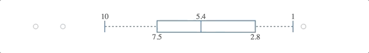

> [d2b](../README.md) › **SVG Box**



# {#generator}
[#](#generator) d2b.**box**()

Constructs a new box generator with the default settings.

When using the d2b-box generator you can draw a box and whisker component onto each element in the selection.

# {#apply}
[#](#apply) *box*(*context*)

Render the box(s) to the given *context*, which may be either a [d3-selection](https://github.com/d3/d3-selection) of SVG containers (either SVG or G elements) or a corresponding [d3-transition](https://github.com/d3/d3-transition).

Before applying the d2b-box generator, you should join the data to the selected element(s) using [selection.data](https://github.com/d3/d3-selection#selection_data) or [selection.datum](https://github.com/d3/d3-selection#selection_datum). Here is the default data format.

```javascript
var box = d2b.box(),
    scale = d3.scaleLinear().domain([0, 14]).range([400, 0]);

box.scale(scale).orient('horizontal');

d3.select('body').append('svg')
  .datum({
    maximum: 10,   
    minimum: 1,   
    upperQuartile: 7.5,   
    lowerQuartile: 2.8,
    median: 5.4,
    outliers: [0.5, 12, 13.3]
  })
  .call(box);
```

# {#scale}
[#](#scale) box.**scale**([*scale*])

If *scale* is specified, sets the scale to the specified [d3-scale](https://github.com/d3/d3-scale) and returns the box generator. If *scale* is not specified, returns the current scale, which defaults to a [d3.scaleLinear()](https://github.com/d3/d3-scale#scaleLinear).

# {#annotation}
[#](#annotation) box.**annotation**([*d3-annotation*])

If *d3-annotation* is specified, sets the annotation generator to the specified [d3-annotation](http://d3-annotation.susielu.com/) and returns the box generator. If *d3-annotation* is not specified, returns the current annotation generator, which defaults to a [d3.annotation()](http://d3-annotation.susielu.com/).

# {#enter_scale}
[#](#enter_scale) box.**enterScale**([*scale*])

If *scale* is specified, sets the enter scale to the specified [d3-scale](https://github.com/d3/d3-scale) and returns the box generator. If *scale* is not specified, returns the current enter scale, which defaults to a `null`.

The enter scale will be used to render new box elements and then they will be transformed using the default [box.scale](#scale) either instantly or by the transition context. If a `null` enter scale is used then box elements will be entered using the default [box.scale](#scale).

# {#value_format}
[#](#value_format) box.**valueFormat**([*format*])

If *format* is specified, sets the format function for box-tick-values and returns the box generator. If *format* is not specified, returns the current format function, which defaults to `d => d`.

# {#orient}
[#](#orient) box.**orient**([*orientation*])

If *orientation* is specified, sets the box-orientation and returns the box generator. If *orientation* is not specified, returns the current box-orientation which defaults to `'vertical'`. The orientation should be one of `'vertical'` or `'horizontal'`.

# {#data}
[#](#data) box.**data**([*data*])

If *data* is specified, sets the box-data-accessor function and returns the box generator. If *data* is not specified, returns the current box-data-accessor function which defaults to `d => d`. This method will determine what data object to pass down to the following props. This method receives two arguments, the box bound datum `d` and its index `i`.

### Data Level Accessors

When the d2b box generator is applied to a selection, the following properties will be invoked. The function will be passed the determined [box.data](#data) `d` and the corresponding box index `i`.

# {#median}
[#](#median) box.**median**([*median*])

If *median* is specified, sets the box-median-accessor function and returns the box generator. If *median* is not specified, returns the current box-median-accessor function which defaults to `d => d.median`.

# {#upper_quartile}
[#](#upper_quartile) box.**upperQuartile**([*upperQuartile*])

If *upperQuartile* is specified, sets the box-upper-quartile-accessor function and returns the box generator. If *upperQuartile* is not specified, returns the current box-upper-quartile-accessor function which defaults to `d => d.upperQuartile`.

# {#lower_quartile}
[#](#lower_quartile) box.**lowerQuartile**([*lowerQuartile*])

If *lowerQuartile* is specified, sets the box-lower-quartile-accessor function and returns the box generator. If *lowerQuartile* is not specified, returns the current box-lower-quartile-accessor function which defaults to `d => d.lowerQuartile`.

# {#maximum}
[#](#maximum) box.**maximum**([*maximum*])

If *maximum* is specified, sets the box-maximum-accessor function and returns the box generator. If *maximum* is not specified, returns the current box-maximum-accessor function which defaults to `d => d.maximum`.

# {#minimum}
[#](#minimum) box.**minimum**([*minimum*])

If *minimum* is specified, sets the box-minimum-accessor function and returns the box generator. If *minimum* is not specified, returns the current box-minimum-accessor function which defaults to `d => d.minimum`.

# {#outliers}
[#](#outliers) box.**outliers**([*outliers*])

If *outliers* is specified, sets the box-outliers-accessor function and returns the box generator. If *outliers* is not specified, returns the current box-outliers-accessor function which defaults to `d => d.outliers`. The outliers should be an array of values representing both upper and lower outliers. If any outliers are given between the box's [minimum](#minimum) and [maximum](#maximum) values they will be ignored.

# {#width}
[#](#width) box.**width**([*width*])

If *width* is specified, sets the box-width-accessor function and returns the box generator. If *width* is not specified, returns the current box-width-accessor function which defaults to `() => 20`.

# {#color}
[#](#color) box.**color**([*color*])

If *color* is specified, sets the box-color-accessor function and returns the box generator. If *color* is not specified, returns the current box-color-accessor function which defaults to `() => 'steelblue'`.

## Annotations {#annotations}

The box generator has built in hooks for annotations using the [d3.annotation plugin](d3-annotation.susielu.com). Each box may contain an annotation at its `maximum`, `upperQuartile`, `median`, `lowerQuartile`, and `minimum` locations. For example, a box with annotations at the upper and lower quartiles:

```javascript
{
  maximum: 15,
  minimum: 2,
  upperQuartile: 12,
  lowerQuartile: 4.8,
  median: 7,
  annotations: [
    {
      location: 'upperQuartile',
      dy: 0,
      dx: 60,
      note: {
        title: 'Upper Quartile'
      },
      connector: {
        end : "dot"
      }
    },
    {
      location: 'lowerQuartile',
      dy: 0,
      dx: 60,
      note: {
        title: 'Lower Quartile'
      },
      connector: {
        end : "dot"
      }
    }
  ]
}
```

[#](#annotations) box.**annotations**([*annotations*])

If *annotations* is specified, sets the *annotations* accessor to the specified box-annotations-accessor function and returns the box generator. If *annotations* is not specified, returns the current *annotations* accessor, which defaults to:

```javascript
function (d) {
  return d.annotations;
}
```
