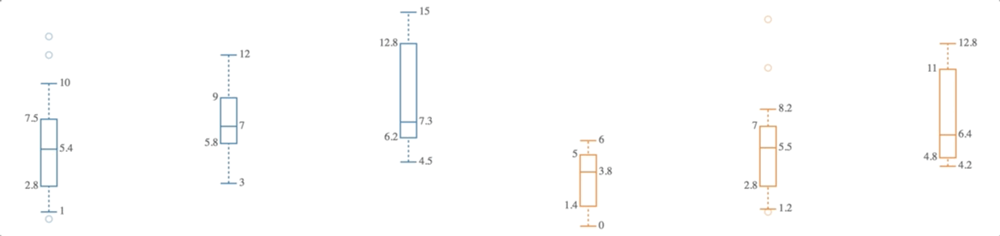

> [d2b](../README.md) › **SVG Box Plot**



# {#generator}
[#](#generator) d2b.**svgBoxPlot**()

Constructs a new box-plot generator with the default settings. The purpose of this module is to provide a common graph API used in other types of graphs (e.g. box-plot, line, area).

When using the d2b-box-plot generator you can draw multiple box-plot graphs onto each element in the selection. This is shown in the data example below.

# {#apply}
[#](#apply) *boxPlot*(*context*)

Render the box-plot(s) to the given *context*, which may be either a [d3-selection](https://github.com/d3/d3-selection) of SVG containers (either SVG or G elements) or a corresponding [d3-transition](https://github.com/d3/d3-transition).

Before applying the d2b-box-plot generator, you should join the data to the selected element(s) using [selection.data](https://github.com/d3/d3-selection#selection_data) or [selection.datum](https://github.com/d3/d3-selection#selection_datum). Here is the default data format.

```javascript
var boxPlot = d2b.svgBoxPlot();

var datum = [
  {
    label: 'Box Plot 1',
    values: [
      {
        x: 1,
        maximum: 10,   
        minimum: 1,   
        upperQuartile: 7.5,   
        lowerQuartile: 2.8,
        median: 5.4,
        outliers: [0.5, 12, 13.3]
      },
      {
        x: 2,
        maximum: 12,   
        minimum: 3,   
        upperQuartile: 9,     
        lowerQuartile: 5.8,
        median: 7
      },
      {
        x: 3,
        maximum: 15,   
        minimum: 4.5,
        upperQuartile: 12.8,  
        lowerQuartile: 6.2,
        median: 7.3
      }
    ]
  },
  {
    label: 'Box Plot 2',
    values: [
      {
        x: 4,
        maximum: 6,    
        minimum: 0,   
        upperQuartile: 5,     
        lowerQuartile: 1.4,
        median: 3.8
      },
      {
        x: 5,
        maximum: 8.2,  
        minimum: 1.2,
        upperQuartile: 7,     
        lowerQuartile: 2.8,
        median: 5.5,
        outliers: [1, 11.1, 14.5]
      },
      {
        x: 6,
        maximum: 12.8,
        minimum: 4.2,
        upperQuartile: 11,    
        lowerQuartile: 4.8,
        median: 6.4
      }
    ]
  }
];

d3.select('.chart')
    .datum(datum)
    .call(boxPlot);  
```

# {#type}
[#](#type) boxPlot.**type**()

Returns the string `boxPlot`.

# {#x}
[#](#x) boxPlot.**x**([*x*])

If *x* is specified, sets the *x* scale to the specified [d3-scale](https://github.com/d3/d3-scale) and returns the box-plot generator. If *x* is not specified, returns the current *x* scale, which defaults to [d3.scaleLinear()](https://github.com/d3/d3-scale#scaleLinear).

# {#y}
[#](#y) boxPlot.**y**([*y*])

If *y* is specified, sets the *y* scale to the specified [d3-scale](https://github.com/d3/d3-scale) and returns the box-plot generator. If *y* is not specified, returns the current *y* scale, which defaults to [d3.scaleLinear()](https://github.com/d3/d3-scale#scaleLinear).

# {#box}
[#](#box) boxPlot.**box**([*box*])

If *box* is specified, sets the *box* scale to the specified d2b-box and returns the box generator. If *box* is not specified, returns the current *box*, which defaults to [d2b.svgBox()](./box.md).

Box can be configured at will except for the [scale](./box.md#scale), [enterScale](./box.md#enter_scale), [orient](./box.md#orient), [data](./box.md#data), and [color](./box.md#color) props, which will be set automatically by the box-plot generator.

# {#annotation}
[#](#annotation) boxPlot.**annotation**([*d3-annotation*])

If *d3-annotation* is specified, sets the annotation generator to the specified [d3-annotation](http://d3-annotation.susielu.com/) and returns the boxPlot generator. If *d3-annotation* is not specified, returns the current annotation generator, which defaults to a [d3.annotation()](http://d3-annotation.susielu.com/).

### Datum Level Accessors

When the d2b box-plot generator is applied to a selection, the following properties will be invoked. The function will be passed the element's bound [datum](https://github.com/d3/d3-selection#selection_datum) `d` and the corresponding element index `i`.

# {#graphs}
[#](#graphs) boxPlot.**graphs**([*graphs*])

If *graphs* is specified, sets the *graphs* array to the specified accessor function or array and returns the box-plot generator. If *graphs* is not specified, returns the current *graphs* accessor, which defaults to `d => d`.

### Graph Level Accessors

When the d2b box-plot generator is applied to a selection, the following properties will be invoked for each graph in the [graphs](#graphs) array. The function will be passed the graph data `d` and the corresponding graph index `i`.

```javascript
function (d) {
  // Here is what d might contain
  // d => {
  //   x: 1,
  //   maximum: 10,   
  //   minimum: 1,   
  //   upperQuartile: 7.5,   
  //   lowerQuartile: 2.8,
  //   median: 5.4,
  //   outliers: [0.5, 12, 13.3]
  // },
  // {
  //   x: 2,
  //   maximum: 12,   
  //   minimum: 3,   
  //   upperQuartile: 9,     
  //   lowerQuartile: 5.8,
  //   median: 7
  // },
  // {
  //   x: 3,
  //   maximum: 15,   
  //   minimum: 4.5,
  //   upperQuartile: 12.8,  
  //   lowerQuartile: 6.2,
  //   median: 7.3
  // }
}
```

# {#tooltip_graph}
[#](#tooltip_graph) boxPlot.**tooltipGraph**([*tooltip_graph*])

If *tooltip_graph* is specified, sets the *tooltip_graph* to the specified accessor function and returns the box-plot generator. If *tooltip_graph* is not specified, returns the current *tooltip_graph* accessor, which defaults to:

```javascript
  function (d) {
    return d.tooltipGraph;
  }
```

# {#shift}
[#](#shift) boxPlot.**shift**([*shift*])

If *shift* is specified, sets the horizontal *shift* to the specified accessor function or value and returns the box-plot generator. If *shift* is not specified, returns the current *shift* accessor, which defaults to `() => null`.

If a `null` accessor is used this shift will be computed dynamically based on the type of [d3-scale](https://github.com/d3/d3-scale) being used. If a band scale is used then the shift will be set to half of the scales bandwidth.

# {#key}
[#](#key) boxPlot.**key**([*key*])

If *key* is specified, sets the graph *key* to the specified function and returns the box-plot generator. If *key* is not specified, returns the current *key* accessor, which defaults to `(d) => d.label`.

If you are transitioning from one data set to another the key function is useful in making sure the proper graphs get updated to their corresponding values.

# {#color}
[#](#color) boxPlot.**color**([*color*])

If *color* is specified, sets the *color* accessor to the specified function or string and returns the box-plot generator. If *color* is not specified, returns the current *color* accessor, which defaults to:

```javascript
// define d3 color scale that will be used in the accessor
var color = d3.scaleOrdinal(d3.schemeCategory10);

function (d) {
  return color(d.label);
}
```

If you are transitioning from one data set to another the key function is useful in making sure the proper graphs get updated to their corresponding values.

# {#orient}
[#](#orient) box.**orient**([*orientation*])

If *orientation* is specified, sets the box-plot-orientation to the specified function or string. If *orientation* is not specified, returns the current box-plot-orientation accessor function, which defaults to `'vertical'`. The orientation should be one of `'vertical'` or `'horizontal'`.

# {#values}
[#](#values) boxPlot.**values**([*values*])

If *values* is specified, sets the *values* array to the specified accessor function or array and returns the box-plot generator. If *values* is not specified, returns the current *values* accessor, which defaults to:

```javascript
function (d) {
  return d.values;
}
```

### Value Level Accessors

When the d2b box-plot generator is applied to a selection, the following properties will be invoked for each element in the [values](#values) array. The function will be passed the value data `d` and the index position within the [values](#children) array `i`.

```javascript
function (d) {
  // Here is what d might contain
  // d => {
  //   x: 1,
  //   maximum: 10,   
  //   minimum: 1,   
  //   upperQuartile: 7.5,   
  //   lowerQuartile: 2.8,
  //   median: 5.4,
  //   outliers: [0.5, 12, 13.3]
  // }
}
```

# {#px}
[#](#px) boxPlot.**px**([*px*])

If *px* is specified, sets the *px* accessor to the specified accessor function and returns the box-plot generator. If *px* is not specified, returns the current *px* accessor, which defaults to:

```javascript
function (d) {
  return d.x;
}
```

Note: In the case of a `'horizontal'` [orient](#orient), the invoked x value will not be used.

# {#py}
[#](#py) boxPlot.**py**([*py*])

If *py* is specified, sets the *py* accessor to the specified accessor function and returns the box-plot generator. If *py* is not specified, returns the current *py* accessor, which defaults to:

```javascript
function (d) {
  return d.y;
}
```

Note: In the case of a `'vertical'` [orient](#orient), the invoked x value will not be used.

# {#pcolor}
[#](#pcolor) boxPlot.**pcolor**([*color*])

If *color* is specified, sets the *color* accessor to the specified accessor function and returns the box-plot generator. If *color* is not specified, returns the current *color* accessor, which defaults to `() => null`.

If *color* is `null` then the corresponding graph [color](#color) will be used.

# {#pkey}
[#](#pkey) boxPlot.**pkey**([*key*])

If *key* is specified, sets the *key* accessor to the specified accessor function and returns the box-plot generator. If *key* is not specified, returns the current *key* accessor, which defaults to `(d, i) => i`.

If transitioning between data sets, the [key](#pkey) may be used to be sure that the matching box-plot points transition properly.

# {#pannotations}
[#](#pannotations) boxPlot.**pannotations**([*annotations*])

If *annotations* is specified, sets the *annotations* accessor to the specified accessor function and returns the boxPlot generator. If *annotations* is not specified, returns the current *annotations* accessor, which defaults to:

```javascript
function (d) {
  return d.annotations;
}
```

## Annotations {#annotations}

The box plot generator has built in hooks for annotations using the [d3.annotation plugin](d3-annotation.susielu.com). Each box in an box plot may contain an annotation at its `maximum`, `upperQuartile`, `median`, `lowerQuartile`, and `minimum` locations. For example, a box with annotations at the upper and lower quartiles:

```javascript
{
  x: 2,
  maximum: 15,
  minimum: 2,
  upperQuartile: 12,
  lowerQuartile: 4.8,
  median: 7,
  annotations: [
    {
      location: 'upperQuartile',
      dy: 0,
      dx: 60,
      note: {
        title: 'Upper Quartile'
      },
      connector: {
        end : "dot"
      }
    },
    {
      location: 'lowerQuartile',
      dy: 0,
      dx: 60,
      note: {
        title: 'Lower Quartile'
      },
      connector: {
        end : "dot"
      }
    }
  ]
}
```

### Other Methods

# {#get_computed_graphs}
[#](#get_computed_graphs) boxPlot.**getComputedGraphs**(*context*)

Returns the array of computed graphs for the context's datum. This is not the same as the graphs array provided in the datum. This is a constructed graphs array that invokes all of the accessors described above. Usually this is used internally by the [d2b.chartAxis](../charts/chart-axis.md) module.

# {#get_visible_points}
[#](#get_visible_points) boxPlot.**getVisiblePoints**(*context*)

Returns the array of visible points. This array will be formed by concatenating all of the graph values and invoking the [px](#px) and [py](#py) accessor for each. This is helpful when trying to dynamically update the scale domains based on the range of x and y values. Usually this is used internally by the [d2b.chartAxis](../charts/chart-axis.md) module.
