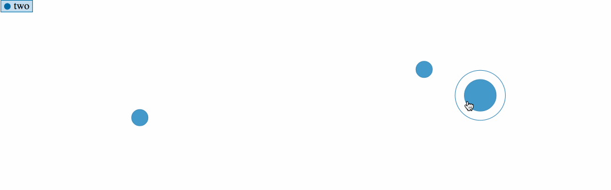

> [d2b](../README.md) › **SVG BubblePack**



# {#generator}
[#](#generator) d2b.**svgBubblePack**()

Constructs a new bubblePack generator with the default settings. The purpose of this module is to provide a common graph API used in other types of graphs (e.g. area, line, bar).

When using the d2b-bubblePack generator you can draw multiple bubblePack graphs onto each element in the selection. This is shown in the data example below.

# {#apply}
[#](#apply) *bubblePack*(*context*)

Render the bubblePack(s) to the given *context*, which may be either a [d3-selection](https://github.com/d3/d3-selection) of SVG containers (either SVG or G elements) or a corresponding [d3-transition](https://github.com/d3/d3-transition).

Before applying the d2b-bubblePack generator, you should join the data to the selected element(s) using [selection.data](https://github.com/d3/d3-selection#selection_data) or [selection.datum](https://github.com/d3/d3-selection#selection_datum). The data format is different than other d2b graph generators because it is hierarchical. Here is the default data format.

```javascript
var bubblePack = d2b.svgBubblePack();

var datum = [
  {
    label: 'Bubble Pack Graph 1',
    values: [
      {
        label: 'Parent 1',
        // By setting expanded to true, this bubble will initially be expanded
        // expanded: true,
        children: [
          {
            label: 'Parent 1 Child 1',
            children: [
              {
                label: 'Parent 1 Child 1 Child 1',
                size: 20,
                x: 15,
                y: 25
              },
              {
                label: 'Parent 1 Child 1 Child 2',
                size: 4,
                x: 34,
                y: 14
              }
            ]
          },
          {
            label: 'Parent 1 Child 2',
            size: 10,
            x: 25,
            y: 14
          }
        ],
      },
      {
        label: 'Parent 2',
        size: 10,
        x: 31,
        y: 45
      }
    ]
  },
  {
    label: 'Bubble Pack Graph 2',
    values: [
      {
        label: 'Parent 1',
        size: 22,
        x: 4,
        y: 50
      }
    ]
  }
];

d3.select('.chart')
    .datum(datum)
    .call(bubblePack);  
```

The leaf nodes of the data should contain size, x, and y values.

### Expanding Bubbles

By default if a node has an array of children then it can be "expanded". When the user clicks on a bubble the bubble will disappear and the children bubbles will transition to their respective locations. This can also be done programmatically by setting the `expanded` flag on a node in the hierarchy.

# {#type}
[#](#type) bubblePack.**type**()

Returns the string `bubblePack`.

# {#point}
[#](#point) bubblePack.**point**([*point*])

If *point* is specified, sets the *point* generator to the specified *point* and returns the bubblePack generator. If *point* is not specified, returns the current *point* generator, which defaults to:

```javascript
  var point = d2b.point().size(d => d.size * 100);

  function () {
    return point;
  }
```

The *point* can be configured at will, except for the [active](point.md#point_active), [fill](point.md#point_fill), and [type](point.md#point_type) properties which will be set automatically by the bubblePack generator.

# {#x}
[#](#x) bubblePack.**x**([*x*])

If *x* is specified, sets the *x* scale to the specified [d3-scale](https://github.com/d3/d3-scale) and returns the bubblePack generator. If *x* is not specified, returns the current *x* scale, which defaults to a [d3.scaleLinear()](https://github.com/d3/d3-scale#scaleLinear).

Currently, only [continuous](https://github.com/d3/d3-scale#continuous-scales) scales are supported for the bubble pack.

# {#y}
[#](#y) bubblePack.**y**([*y*])

If *y* is specified, sets the *y* scale to the specified [d3-scale](https://github.com/d3/d3-scale) and returns the bubblePack generator. If *y* is not specified, returns the current *y* scale, which defaults to a [d3.scaleLinear()](https://github.com/d3/d3-scale#scaleLinear).

Currently, only [continuous](https://github.com/d3/d3-scale#continuous-scales) scales are supported for the bubble pack.

### Datum Level Accessors

When the d2b bubblePack generator is applied to a selection, the following properties will be invoked. The function will be passed the element's bound [datum](https://github.com/d3/d3-selection#selection_datum) `d` and the corresponding element index `i`.

# {#graphs}
[#](#graphs) bubblePack.**graphs**([*graphs*])

If *graphs* is specified, sets the *graphs* array to the specified accessor function or array and returns the bubblePack generator. If *graphs* is not specified, returns the current *graphs* accessor, which defaults to `d => d`.

# {#duration}
[#](#duration) bubblePack.**duration**([*duration*])

If *duration* is specified, sets the duration of the internal chart transitions to the specified accessor function or value and returns the bubblePack generator. If *duration* is not specified, returns the current *duration* accessor, which defaults to `() => 250`.

### Graph Level Accessors

When the d2b bubblePack generator is applied to a selection, the following properties will be invoked for each graph in the [graphs](#graphs) array. The function will be passed the graph data `d` and the corresponding graph index `i`.

```javascript
function (d) {
  // Here is what d might contain
  // d => {
  //   label: 'Bubble Pack Graph 2',
  //   values: [
  //     {
  //       label: 'Parent 1',
  //       size: 22,
  //       x: 4,
  //       y: 50
  //     }
  //   ]
  // }
}
```

# {#tendancy}
[#](#tendancy) bubblePack.**tendancy**([*tendancy*])

If *tendancy* is specified, sets the *tendancy* to the specified accessor function or d2b math tendancy  (e.g. [d2b.mean](../math/mean.md), [d2b.median](../math/median.md)) and returns the bubblePack generator. If *tendancy* is not specified, returns the current *tendancy* scale accessor, which defaults to:

```javascript
function () {
  return d2b.mean;
}
```

# {#tooltip_graph}
[#](#tooltip_graph) bubblePack.**tooltipGraph**([*tooltip_graph*])

If *tooltip_graph* is specified, sets the *tooltip_graph* to the specified accessor function and returns the bubblePack generator. If *tooltip_graph* is not specified, returns the current *tooltip_graph* accessor, which defaults to:

```javascript
  function (d) {
    return d.tooltipGraph;
  }
```

# {#shift}
[#](#shift) bubblePack.**shift**([*shift*])

If *shift* is specified, sets the horizontal *shift* to the specified accessor function or value and returns the bubblePack generator. If *shift* is not specified, returns the current *shift* accessor, which defaults to `() => null`.

If a `null` accessor is used this shift will be computed dynamically based on the type of [d3-scale](https://github.com/d3/d3-scale) being used. If a band scale is used then the shift will be set to half of the scale's bandwidth.

# {#symbol}
[#](#symbol) bubblePack.**symbol**([*symbol*])

If *symbol* is specified, sets the graph *symbol* accessor to the specified accessor function and returns the bubblePack generator. If *symbol* is not specified, returns the current *symbol* accessor, which defaults to `(d) => d3.symbolCircle`.

This property should be set to one of the preset or custom [d3 symbols](https://github.com/d3/d3-shape#symbols). This symbol type will set the default symbol type for an entire graph.

# {#key}
[#](#key) bubblePack.**key**([*key*])

If *key* is specified, sets the graph *key* accessor to the specified accessor function and returns the bubblePack generator. If *key* is not specified, returns the current *key* accessor, which defaults to `(d) => d.label`.

If you are transitioning from one data set to another the key function is useful in making sure the proper graphs get updated to their corresponding values.

# {#color}
[#](#color) bubblePack.**color**([*color*])

If *color* is specified, sets the *color* accessor to the specified accessor function and returns the bubblePack generator. If *color* is not specified, returns the current *color* accessor, which defaults to:

```javascript
// define d3 color scale that will be used in the accessor
var color = d3.scaleOrdinal(d3.schemeCategory10);

function (d) {
  return color(d.label);
}
```

If you are transitioning from one data set to another the key function is useful in making sure the proper graphs get updated to their corresponding values.

# {#values}
[#](#values) bubblePack.**values**([*values*])

If *values* is specified, sets the *values* array to the specified accessor function or array and returns the bubblePack generator. If *values* is not specified, returns the current *values* accessor, which defaults to:

```javascript
function (d) {
  return d.values;
}
```

### Value Level Accessors

When the d2b bubblePack generator is applied to a selection, the hierarchical `value` data will be flattened and the following accessors will invoked for each node in the flattened array. The function will be passed the value data `d`, the index position within it's [values](#values) or [children](#children) array `i`, and the corresponding graph data `graph`.

Note that not every accessor will be invoked for all nodes in the hierarchy, sometimes the "hidden" nodes won't need certain properties to be processed.

```javascript
function (d, i, graph) {
  // An example of the node data being passed to the accessor function
  // d => {
  //   label: 'Parent 1 Child 1',
  //   children: [
  //     {
  //       label: 'Parent 1 Child 1 Child 1',
  //       size: 20,
  //       x: 15,
  //       y: 25
  //     },
  //     {
  //       label: 'Parent 1 Child 1 Child 2',
  //       size: 4,
  //       x: 34,
  //       y: 14
  //     }
  //   ]
  // }
}
```

# {#px}
[#](#px) bubblePack.**px**([*px*])

If *px* is specified, sets the *px* accessor to the specified accessor function and returns the bubblePack generator. If *px* is not specified, returns the current *px* accessor, which defaults to:

```javascript
function (d) {
  return d.x;
}
```

# {#py}
[#](#py) bubblePack.**py**([*py*])

If *py* is specified, sets the *py* accessor to the specified accessor function and returns the bubblePack generator. If *py* is not specified, returns the current *py* accessor, which defaults to:

```javascript
function (d) {
  return d.y;
}
```

# {#pcolor}
[#](#pcolor) bubblePack.**pcolor**([*color*])

If *color* is specified, sets the *color* accessor to the specified accessor function and returns the bubblePack generator. If *color* is not specified, returns the current *color* accessor, which defaults to `() => null`.

If *color* is `null` then the corresponding graph [color](#color) will be used.

# {#psymbol}
[#](#psymbol) bubblePack.**psymbol**([*symbol*])

If *symbol* is specified, sets the *symbol* accessor to the specified accessor function and returns the bubblePack generator. If *symbol* is not specified, returns the current *symbol* accessor, which defaults to `() => null`.

If *symbol* is `null` then the corresponding graph [symbol](#symbol) type will be used.

# {#psize}
[#](#psize) bubblePack.**psize**([*size*])

If *size* is specified, sets the *size* accessor to the specified accessor function and returns the bubblePack generator. If *size* is not specified, returns the current *size* accessor, which defaults to:

```javascript
function (d) {
  return d.size;
}
```

The *size* is a numerical value corresponding to the pixel area of the defined symbol type.

# {#pkey}
[#](#pkey) bubblePack.**pkey**([*key*])

If *key* is specified, sets the *key* accessor to the specified accessor function and returns the bubblePack generator. If *key* is not specified, returns the current *key* accessor, which defaults to `(d, i) => i`.

If transitioning between data sets, the [key](#pkey) may be used to be sure that the matching bubblePack points transition properly.

### Other Methods

# {#get_computed_graphs}
[#](#get_computed_graphs) bubblePack.**getComputedGraphs**(*context*)

Returns the array of computed graphs for the context's datum. This is not the same as the graphs array provided in the datum. This is a constructed graphs array that invokes all of the accessors described above. Usually this is used internally by the [d2b.chartAxis](../charts/chart-axis.md) module.

# {#get_visible_points}
[#](#get_visible_points) bubblePack.**getVisiblePoints**(*context*)

Returns the array of visible points. This array will be formed by concatenating all of the graph values and invoking the [px](#px) and [py](#py) accessor for each. This is helpful when trying to dynamically update the scale domains based on the range of x and y values. Usually this is used internally by the [d2b.chartAxis](../charts/chart-axis.md) module.
