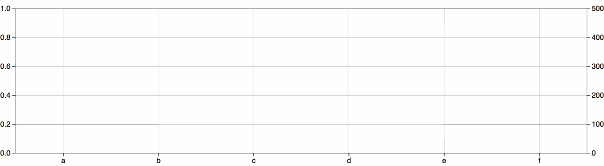

> [d2b](../README.md) › **SVG Plane**



# {#generator}
[#](#generator) d2b.**plane**()

Constructs a new plane generator with the default settings.

The d2b-plane generator allows you to draw a 2D axis plane. The purpose of this generator is to take some of the complexity out of using raw d3 axes.

# {#apply}
[#](#apply) *plane*(*context*)

Render the plane to the given *context*, which may be either a [d3-selection](https://github.com/d3/d3-selection) of SVG containers (either SVG or G elements) or a corresponding [d3-transition](https://github.com/d3/d3-transition).

Before applying the d2b-plane generator, you should join the data to the selected element(s) using [selection.data](https://github.com/d3/d3-selection#selection_data) or [selection.datum](https://github.com/d3/d3-selection#selection_datum). Here is the default data format.

```javascript
var plane = d2b.plane();

var xAxis = d3.axisBottom(d3.scaleLinear()),
    yAxis = d3.axisLeft(d3.scaleLinear());

plane.size({width: 500, height: 300});

d3.select('body').append('svg')
    .datum({
      x: { axis: xAxis },
      y: { axis: yAxis }
    })
    .call(plane);
```

### Datum Level Accessors

When the d2b-plane generator is applied to a selection, the following properties will be invoked. The function will be passed the element's bound [datum](https://github.com/d3/d3-selection#selection_datum) `d` and the corresponding element index `i`.

# {#size}
[#](#size) plane.**size**([*size*])

If *size* is specified, sets the size-accessor to the specified function or object. If *size* is not specified, returns the current size-accessor. The points are sized by a pixel area value. The *size* will be the outer dimensions of the plane. If a `null` size is specified then a default size of `{ width: 960, height: 500 }` will be used.

# {#padding}
[#](#padding) plane.**padding**([*padding*])

If *padding* is specified, sets the padding-accessor to the specified function, value, or object. If *padding* is not specified, returns the current padding-accessor. If a `null` padding is specified then it will be computed dynamically based on the dimensions of the surrounding axes and labels.

The *padding* can be specified in the following formats:

```
  // If a value is given then this will be the padding on all sides of the
  // plane. (e.g. top, bottom, right, left will all be 0)
  plane.padding(0);
```

```
  // If an object is given then the padding for each side should be specified.
  plane.padding({ top: 10, bottom: 50, left: 50, right: 10 });
```

```
  // If null is given then the padding will be computed dynamically. this
  // is the default setting.
  plane.padding(null);
```

# {#margin}
[#](#margin) plane.**margin**([*margin*])

If *margin* is specified, sets the margin-accessor to the specified function, value, or object. If *margin* is not specified, returns the current margin-accessor. The default margin-accessor is `() => 0`.

The *margin* can be specified in the following formats:

```
  // If a value is given then this will be the margin on all sides of the
  // plane. (e.g. top, bottom, right, left will all be 0)
  plane.margin(0);
```

```
  // If an object is given then the margin for each side should be specified.
  plane.margin({ top: 10, bottom: 50, left: 50, right: 10 });
```

# {#axes}
[#](#axes) plane\[**axisType**\]([*config*])

If *config* is specified, sets the config-accessor to the specified function or object. If *config* is not specified, returns the current config-accessor. The default config-accessor is `d => d[axisType]`.

If a `falsy` config is specified then this axis will not be rendered. The *config* uses the following format unless axis accessors are used to change this format. The following format example is for a [plane.x](#x) configuration.

```
  {
    // Axis property is required if using an x-axis. This is also how the chosen
    // scale should be specified.

    axis: d3.axisBottom(d3.scaleLinear()),

    // Optional orient property can be used. Should be 'inner' or 'outer'.
    // Specifies whether the axis will be positioned on the inside of the plane
    // or outside of the plane. This should be paired with the d3-axis type.
    // E.g. if an x axis positioned on the inner bottom edge of the plane is
    // desired then axis: d3.axisTop() and orient: 'inner' should be used.

    // orient: 'outer',

    // Optional wrap length can be specified to indicate how many characters
    // should be allowed on each line before wrapping occurs.

    // wrapLength: 15,

    // Optional, tick size can be specified. The tick size defaults to 6 and
    // overrides the tickSize on the provided axis.

    // tickSize: 15,

    // Optional grid display can be toggled on or off for each axis. Defaults
    // to true.

    // showGrid: false,

    // Optional label can be specified.

    // label: 'Dollars',

    // Optional label orientation can be specified. Should be 2 words separated
    // by a space. Like 'inner start', 'outer end', 'inner middle', etc..

    // labelOrient: 'outer middle',

  }
```

# {#x}
[#](#x) plane.**x**([*x-config*])

See [plane\[axisType\]](#axes).

# {#y}
[#](#y) plane.**y**([*y-config*])

See [plane\[axisType\]](#axes).

# {#x2}
[#](#x2) plane.**x2**([*x2-config*])

See [plane\[axisType\]](#axes).

# {#y2}
[#](#y2) plane.**y2**([*y2-config*])

See [plane\[axisType\]](#axes).

### Axis Level Accessors

When the d2b-plane generator is applied to a selection, the following properties will be invoked for each x, y, x2, or y2 axis that is specified. The function will be passed the axis data `d` and the index `i` of the plane element within the supplied selection or transition.

# {#axis}
[#](#axis) plane.**axis**([*axis*])

If *axis* is specified, sets the axis-accessor to the specified function. If *axis* is not specified, returns the current axis-accessor, which defaults to `d => d.axis`.

# {#orient}
[#](#orient) plane.**orient**([*orient*])

If *orient* is specified, sets the orient-accessor to the specified function or string. If *orient* is not specified, returns the current orient-accessor, which defaults to `d => d.orient || 'outer'`. The axis *orient* should be either `inner` or `outer`.

# {#wrap_length}
[#](#wrap_length) plane.**wrapLength**([*characters*])

If *characters* is specified, sets the wrapLength-accessor to the specified function or value. If *characters* is not specified, returns the current wrapLength-accessor, which defaults to `d => d.wrapLength || Infinity`. The wrap length character count specifies how many characters should be allowed on each line for each tick of the axes.

# {#tick_size}
[#](#tick_size) plane.**tickSize**([*tickSize*])

If *tickSize* is specified, sets the tickSize-accessor to the specified function or value. If *tickSize* is not specified, returns the current tickSize-accessor, which defaults to `d => d.tickSize || 6`. The axis *tickSize* replaces the [d3-axis tickSize](https://github.com/d3/d3-axis#axis_tickSize) property which will be configured automatically based on the axis orientation and the specified *tickSize*.

# {#show_grid}
[#](#show_grid) plane.**showGrid**([*boolean*])

If *boolean* is specified, sets the showGrid-accessor to the specified function or boolean. If *boolean* is not specified, returns the current showGrid-accessor, which defaults to `d => d.showGrid === false`. This boolean will decide whether the grid for this axis will be rendered or not.

# {#label}
[#](#label) plane.**label**([*label*])

If *label* is specified, sets the label-accessor to the specified function. If *label* is not specified, returns the current label-accessor, which defaults to `d => d.label`. A `falsy` label will not be used.

# {#label_orient}
[#](#label_orient) plane.**labelOrient**([*orient*])

If *orient* is specified, sets the label-orient-accessor to the specified function or string. If *orient* is not specified, returns the current label-orient-accessor, which defaults to `d => d.labelOrient || 'outer middle'`. The axis *orient* should be 2 words separated by a space. Like `inner start`, `outer end`, `inner middle`, etc..

### Other Methods

# {#box}
[#](#box) plane.**box**(*context*)

After the plane has been rendered you can retrieve the box for a single element d3 selection by using the plane.box(*context*) helper method. This box will allow you to judge the padding and dimensions of the inner plane. It will have the following format:

```
  {
    width: /* plane inner width */,
    height: /* plane inner height */,
    top: /* plane top spacing (padding + margin) */,
    bottom: /* plane bottom spacing (padding + margin) */,
    left: /* plane left spacing (padding + margin) */,
    right: /* plane right spacing (padding + margin) */,
  }
```
