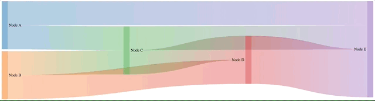

> [d2b](../README.md) › **SVG Sankey**



# {#generator}
[#](#generator) d2b.**svgSankey**()

Constructs a new sankey generator with the default settings.

# {#apply}
[#](#apply) *sankey*(*context*)

Render the sankey(s) to the given *context*, which may be either a [d3-selection](https://github.com/d3/d3-selection) of SVG containers (either SVG or G elements) or a corresponding [d3-transition](https://github.com/d3/d3-transition).

Before applying the d2b-sankey generator, you should join the data to the selected element(s) using [selection.data](https://github.com/d3/d3-selection#selection_data) or [selection.datum](https://github.com/d3/d3-selection#selection_datum). Here is the default data format.

```javascript
var sankey = d2b.svgSankey();


// use d3 to select the svg, set the datum, and apply the sankey generator
var svg = d3.select('svg g')
  .datum({
    nodes: [
      {name: 'Node A'},
      {name: 'Node B'},
      {name: 'Node C'},
      {name: 'Node D'},
      {name: 'Node E'},
    ],
    links: [
      {source: 'Node A', target: 'Node E', value: 2},
      {source: 'Node A', target: 'Node C', value: 2},
      {source: 'Node B', target: 'Node C', value: 2},
      {source: 'Node B', target: 'Node D', value: 2},
      {source: 'Node C', target: 'Node D', value: 2},
      {source: 'Node C', target: 'Node E', value: 2},
      {source: 'Node D', target: 'Node E', value: 4},
    ]
  })
  .call(sankey);
```

# {#sankey}
[#](#sankey) sankey.**sankey**([*d3-sankey*])

If *d3-sankey* is specified, sets the *d3-sankey* generator to the specified [d3-sankey](https://github.com/d3/d3-sankey) and returns the sankey generator. If *d3-sankey* is not specified, returns the current *d3-sankey* generator, which defaults to `d3.sankey()`.

The *d3-sankey* can be configured at will, except for the [size](https://github.com/d3/d3-sankey#sankey_size), [nodeId](https://github.com/d3/d3-sankey#sankey_nodeId), [nodes](https://github.com/d3/d3-sankey#sankey_nodes), and [links](https://github.com/d3/d3-sankey#sankey_links) properties which will be set automatically by the sankey generator.

### Datum Level Accessors

When the d2b sankey generator is applied to a selection, the following properties will be invoked. The function will be passed the element's bound [datum](https://github.com/d3/d3-selection#selection_datum) `d`.

# {#size}
[#](#size) sankey.**size**([*size*])

If *size* is specified, sets the size-accessor to the specified function or object. If *size* is not specified, returns the current duration-accessor, which defaults to `() => {width: 960, height: 500}`.

The *size* will be used to propagate down to the d3.sankey [size](https://github.com/d3/d3-sankey#sankey_size) property, it should have a width and height attribute in pixels.

# {#nodes}
[#](#nodes) sankey.**nodes**([*nodes*])

If *nodes* is specified, sets the nodes-accessor to the specified function or array. If *nodes* is not specified, returns the current nodes-accessor, which defaults to `d => d.nodes`.

# {#links}
[#](#links) sankey.**links**([*links*])

If *links* is specified, sets the links-accessor to the specified function or array. If *links* is not specified, returns the current links-accessor, which defaults to `d => d.links`.

### Node Level Accessors

When the d2b sankey generator is applied to a selection, the following properties will be invoked for each node in the [nodes](#nodes) array. The function will be passed the node data `d` and the node index `i`.

```javascript
function (d, i) {
  // Here is what d and i might contain
  // d => { name: 'Node A' }
  // i => 0
}
```

# {#node_key}
[#](#node_key) sankey.**nodeKey**([*key*])

If *key* is specified, sets the node-key-accessor to the specified function. If *key* is not specified, returns the current node-key-accessor, which defaults to `d => d.name`.

# {#node_label}
[#](#node_label) sankey.**nodeLabel**([*label*])

If *label* is specified, sets the node-label-accessor to the specified function. If *label* is not specified, returns the current node-label-accessor, which defaults to `(d, i, key) => key`.

Note: The node label accessor function received a third argument which is the determined [nodeKey](#node_key).

# {#node_label_wrap_length}
[#](#node_label_wrap_length) sankey.**nodeLabelWrapLength**([*label_wrap_length*])

If *wrap_length* is specified, sets the node-label-wrap-length-accessor to the specified function or value in pixels. If *wrap_length* is not specified, returns the current node-label-wrap-length-accessor, which defaults to `() => Infinity`.

# {#node_draggable_x}
[#](#node_draggable_x) sankey.**nodeDraggableX**([*boolean*])

If *boolean* is specified, sets the node-draggable-x-accessor to the specified function or bool. If *boolean* is not specified, returns the current node-draggable-x-accessor, which defaults to `() => false`.

# {#node_draggable_y}
[#](#node_draggable_y) sankey.**nodeDraggableY**([*boolean*])

If *boolean* is specified, sets the node-draggable-y-accessor to the specified function or bool. If *boolean* is not specified, returns the current node-draggable-y-accessor, which defaults to `() => false`.

# {#node_preserve_dragging}
[#](#node_preserve_dragging) sankey.**nodePreserveDragging**([*boolean*])

If *boolean* is specified, sets the node-preserve-dragging-accessor to the specified function or bool. If *boolean* is not specified, returns the current node-preserve-dragging-accessor, which defaults to `() => true`. If preserve dragging is enabled then every update the component will attempt to use the previous **dragged to** location for the sankey nodes.

# {#node_color}
[#](#node_color) sankey.**nodeColor**([*color*])

If *color* is specified, sets the node-color-accessor to the specified function or color. If *color* is not specified, returns the current node-color-accessor, which defaults to:

```javascript
// define d3 color scale that will be used in the accessor
var color = d3.scaleOrdinal(d3.schemeCategory10);

function (d, i, key) {
  return color(key);
}
```

Note: The node color accessor function received a third argument which is the determined [nodeKey](#node_key).

### Link Level Accessors

When the d2b sankey generator is applied to a selection, the following properties will be invoked for each link in the [links](#links) array. The function will be passed the link data `d` and the link index `i`.

```javascript
function (d, i) {
  // Here is what d and i might contain
  // d => {source: 'Node A', target: 'Node E', value: 2}
  // i => 0
}
```

# {#link_source}
[#](#link_source) sankey.**linkSource**([*source*])

If *source* is specified, sets the link-source-accessor to the specified function. If *source* is not specified, returns the current link-source-accessor, which defaults to `d => d.source`.

# {#link_source_color}
[#](#link_source_color) sankey.**linkSourceColor**([*color*])

If *color* is specified, sets the link-source-color-accessor to the specified function or color. If *color* is not specified, returns the current link-source-color-accessor, which defaults to:

```javascript
// define d3 color scale that will be used in the accessor
var color = d3.scaleOrdinal(d3.schemeCategory10);

function (d, i, sourceColor) {
  return sourceColor;
}
```

Note: The link source color accessor function receives a third argument which is the determined source color [nodeColor](#node_color).

# {#link_target}
[#](#link_target) sankey.**linkTarget**([*target*])

If *target* is specified, sets the link-target-accessor to the specified function. If *target* is not specified, returns the current link-target-accessor, which defaults to `d => d.target`.

# {#link_target_color}
[#](#link_target_color) sankey.**linkTargetColor**([*color*])

If *color* is specified, sets the link-target-color-accessor to the specified function or color. If *color* is not specified, returns the current link-target-color-accessor, which defaults to:

```javascript
// define d3 color scale that will be used in the accessor
var color = d3.scaleOrdinal(d3.schemeCategory10);

function (d, i, targetKey) {
  return color(targetKey);
}
```

Note: The link source color accessor function receives a third argument which is the determined target color [nodeColor](#node_color).

# {#link_key}
[#](#link_key) sankey.**linkKey**([*key*])

If *key* is specified, sets the link-key-accessor to the specified function. If *key* is not specified, returns the current link-key-accessor, which defaults to ``(d, i, sourceKey, targetKey) => `${sourceKey}-${targetKey}` ``.

Note: The link key accessor function received a third and fourth argument which are the determined source [nodeKey](#node_key) and target [nodeKey](#node_key) respectively.

# {#link_value}
[#](#link_value) sankey.**linkValue**([*value*])

If *value* is specified, sets the link-value-accessor to the specified function or value. If *value* is not specified, returns the current link-value-accessor, which defaults to `d => d.value`.
