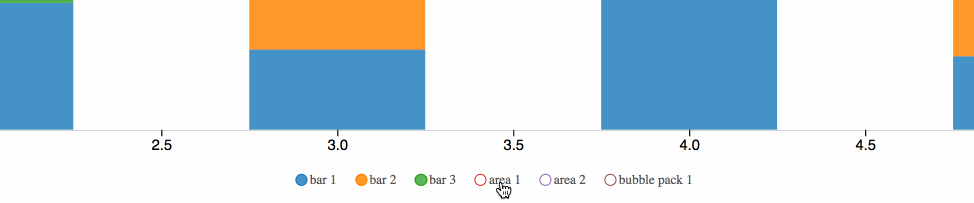

> [d2b](../README.md) › **Legend**



The d2b legend component is used to render a vertical or horizontal legend.

# {#generator}
[#](#legend) d2b.**legend**()

Constructs a new legend generator.

# {#apply}
[#](#apply) *legend*(*context*)

Render the legend(s) to the given *context*, which may be either a [d3-selection](https://github.com/d3/d3-selection) of HTML containers (e.g. `div`) or a corresponding [d3-transition](https://github.com/d3/d3-transition).

Before applying the d2b-legend generator, you should join the data to the selected element(s) using [selection.data](https://github.com/d3/d3-selection#selection_data) or [selection.datum](https://github.com/d3/d3-selection#selection_datum). Here is the default data format.

```javascript
var color = d3.scaleOrdinal(d3.schemeCategory10);
var legend = d2b.legend();

legend
  .vertical(false)
  .clickable(true)
  .dblclickable(true)
  .color(function (d, i) { return color(i); });

d3.select('div.legend')
  .datum([
    { html: 'First' },
    { html: 'Second' },
    { html: 'Third' },
    { html: 'Fourth' },
  ])
  .call(legend);
```

### Datum Level Accessors

When the d2b legend generator is applied to a selection, the following properties will be invoked. The function will be passed the element's bound [datum](https://github.com/d3/d3-selection#selection_datum) `d` and the corresponding element index `i`.

# {#clickable}
[#](#clickable) legend.**clickable**([*clickable*])

If *clickable* is specified, sets the *clickable* array to the specified accessor function or boolean and returns the legend generator. If *clickable* is not specified, returns the current *clickable* accessor, which defaults to:

```javascript
function (d) {
  return false;
}
```

If the legend is *clickable* then you can toggle the legend item's `empty` property by clicking on them (If an item has the property `empty = true` then the item's icon will appear as an outline only). When a legend item is toggled, a `change` event will be dispatched and bubbled up through the DOM. For example:

```javascript
legend.clickable(true);

d3.select('div.legend')
  .call(legend)
  .on('change', function () {
    // Do something here, such as a chart update based on the state of each legend item
  });
```

# {#dblclickable}
[#](#dblclickable) legend.**dblclickable**([*dblclickable*])

If *dblclickable* is specified, sets the *dblclickable* array to the specified accessor function or boolean and returns the legend generator. If *dblclickable* is not specified, returns the current *dblclickable* accessor, which defaults to:

```javascript
function (d) {
  return false;
}
```

If the legend is *dblclickable* then you can toggle all legend items "empty" except the one being *dblclicked*. When a legend item is toggled, a `change` event will be dispatched and bubbled up through the DOM. For example:

```javascript
legend.clickable(true).dblclickable(true);

d3.select('div.legend')
  .call(legend)
  .on('change', function () {
    // Do something here, such as a chart update based on the state of each legend item
  });
```

# {#allow_emptied}
[#](#allow_emptied) legend.**allowEmptied**([*allowEmptied*])

If *allowEmptied* is specified, sets the *allowEmptied* array to the specified accessor function or boolean and returns the legend generator. If *allowEmptied* is not specified, returns the current *allowEmptied* accessor, which defaults to:

```javascript
function (d) {
  return false;
}
```

If the legend has it's *allowEmptied* option set to true then it can have all of it's items with the `empty = true` property. However, if it's set to false then when "emptying" the last legend item, all legend items will reset their property to `empty = false`.

# {#vertical}
[#](#vertical) legend.**vertical**([*vertical*])

If *vertical* is specified, sets the *vertical* array to the specified accessor function or boolean and returns the legend generator. If *vertical* is not specified, returns the current *vertical* accessor, which defaults to:

```javascript
function (d) {
  return true;
}
```

# {#values}
[#](#values) legend.**values**([*values*])

If *values* is specified, sets the *values* array to the specified accessor function or array and returns the legend generator. If *values* is not specified, returns the current *values* accessor, which defaults to:

```javascript
function (d) {
  return d;
}
```

### Value Level Accessors

When the d2b legend generator is applied to a selection, the following properties will be invoked for each value in the [values](#values) array. The function will be passed the value data `d` and the corresponding index `i`.

```javascript
function (d) {
  // Here is what d might contain
  // d => { html: 'First' }
}
```

# {#key}
[#](#key) legend.**key**([*key*])

If *key* is specified, sets the *key* function to the specified accessor function and returns the legend generator. If *key* is not specified, returns the current *key* accessor, which defaults to:

```javascript
function (d, i) {
  return i;
}
```

# {#color}
[#](#color) legend.**color**([*color*])

If *color* is specified, sets the *color* function to the specified accessor function or color and returns the legend generator. If *color* is not specified, returns the current *color* accessor, which defaults to:

```javascript
function () {
  return 'blue';
}
```

# {#html}
[#](#html) legend.**html**([*html*])

If *html* is specified, sets the *html* function to the specified accessor function and returns the legend generator. If *html* is not specified, returns the current *html* accessor, which defaults to:

```javascript
function (d) {
  return d.html;
}
```

# {#icon}
[#](#icon) legend.**icon**([*icon*])

If *icon* is specified, sets the *icon* function to the specified accessor function and returns the legend generator. If *icon* is not specified, returns the current *icon* accessor, which defaults to:

```javascript
function () {
  return d3.symbolCircle;
}
```

The specified *icon* can either be a font-awesome character code (e.g. `\uf111` is a circle), or a d2b/d3-shape (e.g. d3.symbolSquare is a square).

# {#empty}
[#](#empty) legend.**empty**([*empty*])

If *empty* is specified, sets the *empty* function to the specified accessor function and returns the legend generator. If *empty* is not specified, returns the current *empty* accessor, which defaults to:

```javascript
function (d) {
  return d.empty;
}
```

# {#set_empty}
[#](#set_empty) legend.**setEmpty**([*setEmpty*])

If *setEmpty* is specified, sets the *setEmpty* function to the specified accessor function and returns the legend generator. If *setEmpty* is not specified, returns the current *setEmpty* accessor, which defaults to:

```javascript
function (d, i, state) {
  d.empty = state;
}
```

The *setEmpty* accessor is provided the empty state in addition to the value data `d` and index `i`.
